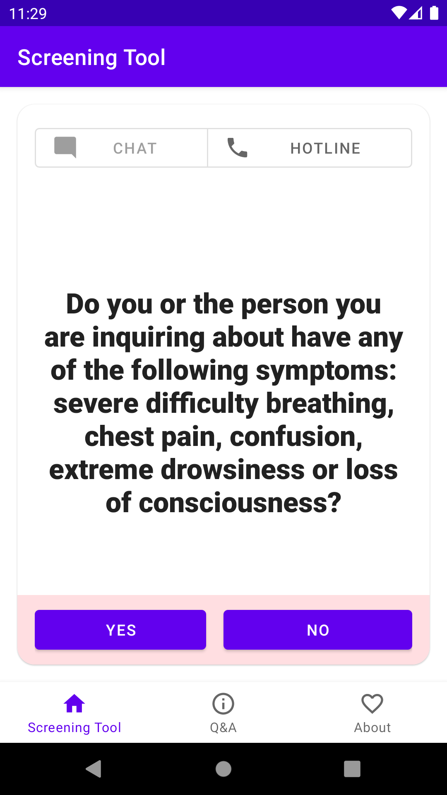
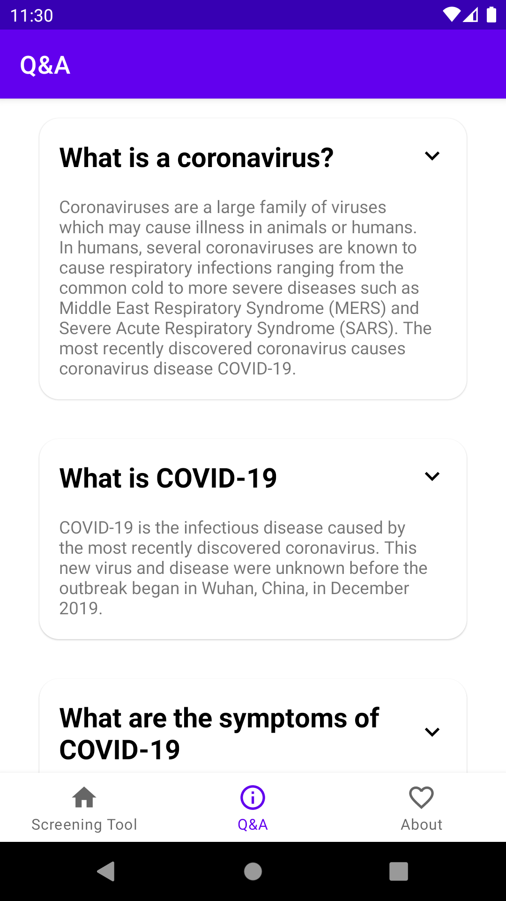
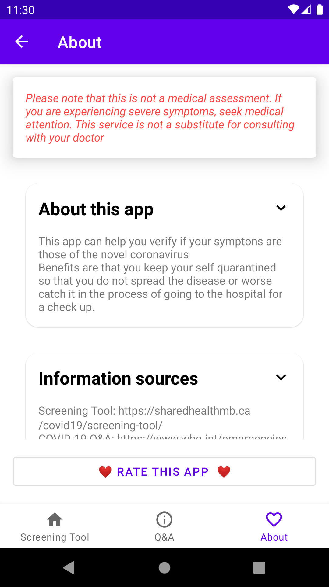

# Cory
Covid-19 app: This app can help you verify if your symptons are those of the novel coronavirus.

Benefits are that you keep your self quarantined so that you do not spread the disease or worse catch it in the process of going to the hospital for a check up. 
* This app has a screening tool from https://sharedhealthmb.ca/covid19/screening-tool/
* FAQ about covid-19 from https://www.who.int/emergencies/diseases/novel-coronavirus-2019

# Contributions
1. Feature contribution
   1. Submit a PR
1. Localise for your own country
   1. Clone Repo, just keep it free 😉
1. New feature?
   1. Add a new [github issue!](https://github.com/dubeboy/cory/issues) 
  
# Screenshots

Screening Tool |  COVID-19 FAQ  |  About App   |
-------------- | -------------- | ------------ |
 |  | 
